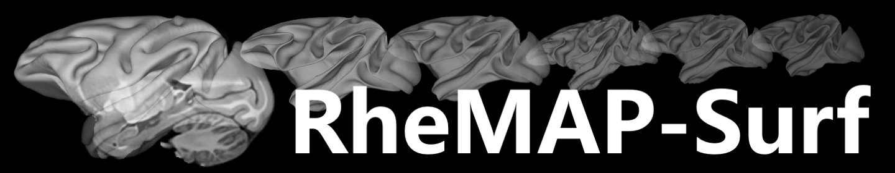
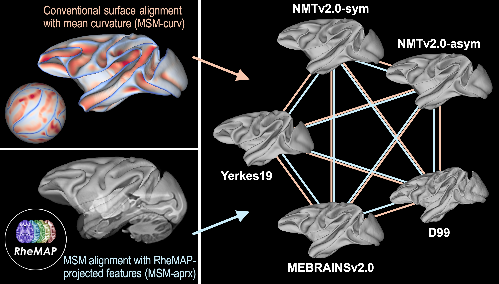

# RheMAP-Surf

**RheMAP-Surf**: Surface Transformations Among Commonly Used Rhesus Macaque Brain Templates

---

The **RheMAP-Surf** project provides **precomputed deformation spheres** for performing **surface-based transformations** among several widely used rhesus macaque brain templates, including **NMT v2.0 (symmetric and asymmetric)**, **D99**, **MEBRAINS v2.0**, and **Yerkes19**. These transformations were generated using FSL's [MSM (Multimodal Surface Matching)](https://fsl.fmrib.ox.ac.uk/fsl/fslwiki/MSM).

This repository includes:

- [Deformation spheres](./deformation_spheres/)
- Standardized [spherical and anatomical surfaces](./surfaces/) for each template
- Source [template files](./templates/)
- A [demo](./demo/) with detailed instructions and example code
- Accompanying [documentation](https://github.com/HumanBrainED/RheMAP-Surf#documentation) covering processing methods, alignment quality assessment, and visualization

In addition, the code and intermediate results produced during the generation of these surface alignments are available via Zenodo: 

**Authors:**
[Zi-Xuan Zhou](https://orcid.org/0000-0002-9894-7934) & [Ting Xu](https://github.com/TingsterX) (Child Mind Institute)

**Citation:**
Zhou, Z.-X., & Xu, T. (2025). RheMAP-Surf: Surface Transformations Among Commonly Used Rhesus Macaque Brain Templates (1.0) [Data set]. Zenodo. https://doi.org/10.5281/zenodo.15642802

---

## Introduction

In macaque neuroimaging, the coexistence of multiple templates poses challenges for cross-study comparability, data integration, and reproducibility. The [RheMAP](https://github.com/PRIME-RE/RheMAP) project addresses this issue at the volume level by providing ANTs-derived nonlinear **volume registrations** among commonly used rhesus macaque templates. However, these volume registrations do not directly resolve discrepancies across **surface spaces**.

To date, there is no community standard for inter-template surface transformations in macaques. Different alignment protocols can lead to substantial variability, complicating comparisons across studies. Moreover, it remains unclear how closely surface-based transformations replicate the effects of volume-based warps, and whether systematic differences exist. The **RheMAP-Surf** project aims to fill these gaps by providing **surface-based counterparts** to the RheMAP volume registrations and evaluating their correspondence.

---

## Project Overview

**RheMAP-Surf** provides precomputed surface deformation fields across five macaque brain templates:

- **NMTv2.0-sym** (symmetric NMT v2.0)
- **NMTv2.0-asym** (asymmetric NMT v2.0)
- **D99**
- **MEBRAINS** (MEBRAINS v2.0)
- **YRK** (Yerkes19)

We standardize the naming of their [spherical and anatomical surfaces](./surfaces/) and corresponding [deformation spheres](./deformation_spheres/), all of which follow consistent conventions. See the [`demo/`](./demo/) for usage examples.

Since deformation spheres from F99 to Yerkes19 have previously been released, we do not include F99-based transformations to avoid introducing additional variability. Users may use Yerkes19 as a bridge, via the F99-to-Yerkes19 transformations available in [`templates/YRK/`](./templates/YRK/).

We provide two alternative sets of deformation spheres:

- [**MSM-curv**](./deformation_spheres/standard_alignment/): conventional MSM alignment using FreeSurfer-derived **mean curvature** as the driving feature. This method reflects a common practice in current neuroimaging studies.
- [**MSM-aprx**](./deformation_spheres/approx_volume_alignment/): MSM alignment based on **RheMAP-projected random features**, designed to approximate ANTs-derived volume registrations and bridge surface and volume transformations.

Detailed quality assessments and visualizations for both sets, as well as comparison analyses between them, are provided in the documents below.

---

## Documentation

For processing workflows, alignment strategies, and evaluation results, please refer to the following markdown reports:

1. [`preprocessing.md`](preprocessing.md)  
   *Surface preprocessing and medial wall harmonization*

2. [`msm_alignment_with_mean_curvature.md`](msm_alignment_with_mean_curvature.md)  
   *Surface alignment using mean curvature (MSM-curv)*

3. [`msm_alignment_with_projected_features.md`](msm_alignment_with_projected_features.md)  
   *Surface alignment using RheMAP-projected features (MSM-aprx)*

4. [`msm_alignment_difference.md`](msm_alignment_difference.md)  
   *Comparison between MSM-curv and MSM-aprx alignment results*

---

If you use this resource, please cite the [Zenodo archive](https://doi.org/10.5281/zenodo.15642802) () and acknowledge the **RheMAP-Surf** project.

---
