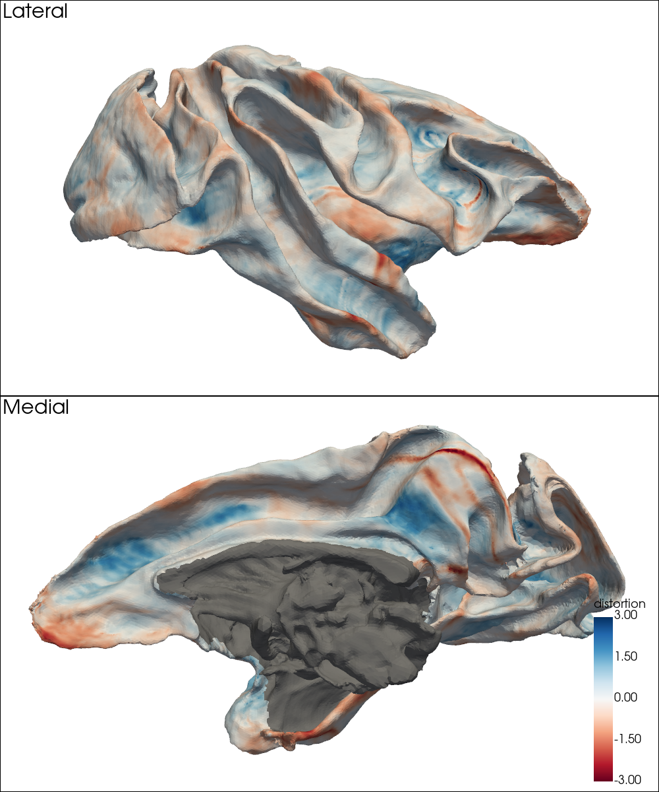
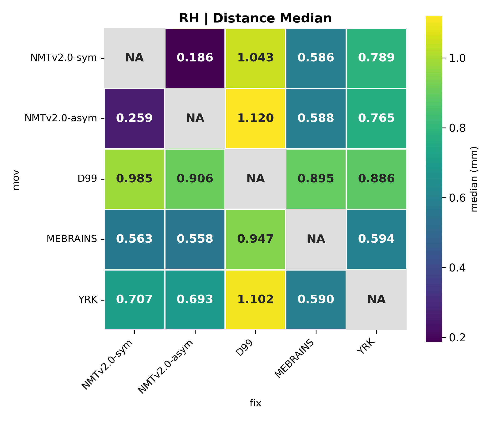

# Difference Between MSM-based Surface Alignment Methods

As explained in [`demo/`](./demo/), the **RheMAP-Surf** project provides two alternative sets of MSM-derived deformation spheres available under [`deformation_spheres/`](./deformation_spheres/). These represent:
- [**MSM-curv**](./deformation_spheres/standard_alignment/): conventional surface alignment driven by mean curvature
- [**MSM-aprx**](./deformation_spheres/approx_volume_alignment/): alignment driven by RheMAP-projected random features, approximating ANTs-derived volume registrations from the RheMAP project

While initial assessments of **MSM-curv** and **MSM-aprx** have been presented in separate documents ([`msm_alignment_with_mean_curvature.md`](msm_alignment_with_mean_curvature.md) and [`msm_alignment_with_projected_features.md`](msm_alignment_with_projected_features.md), respectively), here we directly compare these two alignment strategies and quantify their differences. This analysis aims to inform users about potential variability between the two strategies when choosing deformation spheres for downstream analyses.

Following the approach used in [`msm_alignment_with_projected_features.md`](msm_alignment_with_projected_features.md), we computed vertex-wise distance maps between **MSM-curv** and **MSM-aprx** resampled surfaces using `wb_command -surface-to-surface-3d-distance`. These resampled surfaces were obtained via `wb_command -surface-resample`, using each alignment method separately.

To capture surface distortion, we further calculated log2 area ratios (i.e., ln(aprx/curv)/ln(2)) at each vertex via `wb_command -surface-distortion`. The resulting surface area distortion maps illustrate regional differences in local surface expansion or compression between the two alignment methods.

For both the distance and surface area distortion maps, we computed summary statistics (**median**, **mean**, **maximum**) across non-MW regions and visualized them as heatmaps by hemisphere. Finally, we computed the **cosine similarity** between the mean curvature maps resampled using each surface alignment method and the native curvature maps in the target (fix) space. The results show that, although the two alignment strategies exhibit clear differences in terms of vertex-wise distance and surface area distortion, their impact on mean curvature resampling is relatively minor. **MSM-curv** achieved higher cosine similarity across more inter-template pairs, indicating a modest advantage in preserving curvature features. On the other hand, **MSM-aprx** offers a surface alignment choice that better reflects the ANTs-derived volume registrations from the RheMAP project.

---

## Vertex-Wise Distance Maps

To compare the two MSM alignment methods, we visualized vertex-wise 3D distances between **MSM-curv** and **MSM-aprx** resampled white matter surfaces for each inter-template pair. Each map is shown with a fixed color scale (0–6 mm).

- Diagonal entries are omitted, as self-to-self alignment is not meaningful.
- Off-diagonal entries display distance maps on the target white matter surfaces.

### Left Hemisphere

| Target → \ Moving ↓ | <pre style="text-align:center;"> NMTv2.0-sym </pre> | <pre style="text-align:center;"> NMTv2.0-asym</pre> | <pre style="text-align:center;">     D99     </pre> | <pre style="text-align:center;">   MEBRAINS  </pre> | <pre style="text-align:center;">     YRK     </pre> |
|---------------------|-------------|--------------|-----|----------|-----|
| **NMTv2.0-sym** |  |  |  |  |  |
| **NMTv2.0-asym** |  |  |  |  |  |
| **D99** |  |  |  |  |  |
| **MEBRAINS** |  |  |  |  |  |
| **YRK** |  |  |  |  |  |

### Right Hemisphere

| Target → \ Moving ↓ | <pre style="text-align:center;"> NMTv2.0-sym </pre> | <pre style="text-align:center;"> NMTv2.0-asym</pre> | <pre style="text-align:center;">     D99     </pre> | <pre style="text-align:center;">   MEBRAINS  </pre> | <pre style="text-align:center;">     YRK     </pre> |
|---------------------|-------------|--------------|-----|----------|-----|
| **NMTv2.0-sym** |  |  |  |  |  |
| **NMTv2.0-asym** |  |  |  |  |  |
| **D99** |  |  |  |  |  |
| **MEBRAINS** |  |  |  |  |  |
| **YRK** |  |  |  |  |  |

---

## Vertex-Wise Surface Area Distortion Maps

To compare the two MSM alignment methods, we visualized vertex-wise surface area distortion maps between **MSM-curv** and **MSM-aprx** resampled white matter surfaces for each inter-template pair. Each map is shown with a fixed color scale from –3 to +3.

- Diagonal entries are omitted, as self-to-self alignment is not meaningful.
- Off-diagonal entries display surface area distortion maps on the target white matter surfaces.

### Left Hemisphere

| Target → \ Moving ↓ | <pre style="text-align:center;"> NMTv2.0-sym </pre> | <pre style="text-align:center;"> NMTv2.0-asym</pre> | <pre style="text-align:center;">     D99     </pre> | <pre style="text-align:center;">   MEBRAINS  </pre> | <pre style="text-align:center;">     YRK     </pre> |
|---------------------|-------------|--------------|-----|----------|-----|
| **NMTv2.0-sym** |  |  |  |  |  |
| **NMTv2.0-asym** |  |  |  |  |  |
| **D99** |  |  |  |  |  |
| **MEBRAINS** |  |  |  |  |  |
| **YRK** |  |  |  |  |  |

### Right Hemisphere

| Target → \ Moving ↓ | <pre style="text-align:center;"> NMTv2.0-sym </pre> | <pre style="text-align:center;"> NMTv2.0-asym</pre> | <pre style="text-align:center;">     D99     </pre> | <pre style="text-align:center;">   MEBRAINS  </pre> | <pre style="text-align:center;">     YRK     </pre> |
|---------------------|-------------|--------------|-----|----------|-----|
| **NMTv2.0-sym** |  |  |  |  |  |
| **NMTv2.0-asym** |  |  |  |  |  |
| **D99** |  |  |  |  |  |
| **MEBRAINS** |  |  |  |  |  |
| **YRK** |  |  |  |  |  |

---

## Heatmap Summaries

### Distance

This section presents the **median**, **mean**, and **maximum** values of the distance maps (non-MW regions only), visualized as heatmaps across all inter-template pairs, separately for the left and right hemispheres.

| Statistic       | Left Hemisphere | Right Hemisphere |
|:---------------:|:---------------:|:----------------:|
| **Median** |        |        |
| **Mean**   |          |          |
| **Max**    |           |           |

### Absolute Surface Area Distortion

This section presents the **median**, **mean**, and **maximum** values of the absolute surface area distortion maps (non-MW regions only), visualized as heatmaps across all inter-template pairs, separately for the left and right hemispheres.

| Statistic       | Left Hemisphere | Right Hemisphere |
|:---------------:|:---------------:|:----------------:|
| **Median** |        |        |
| **Mean**   |          |          |
| **Max**    |           |           |

### Cosine Similarity (Mean Curvature Resampling)

This section presents the **cosine similarity** between mean curvature maps resampled using each surface alignment method (**MSM-curv** or **MSM-aprx**) and the corresponding native curvature maps in the target (fix) space. Similarity was computed over non-MW regions and visualized as heatmaps across all inter-template pairs, separately for the left and right hemispheres.

| Alignment Method | Left Hemisphere | Right Hemisphere |
|:----------------:|:---------------:|:----------------:|
| **MSM-curv** |  |  |
| **MSM-aprx** |  |  |

---
