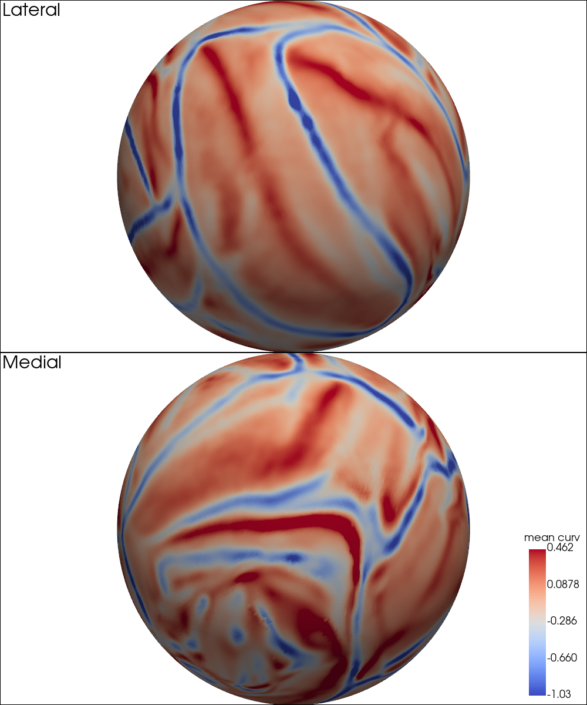
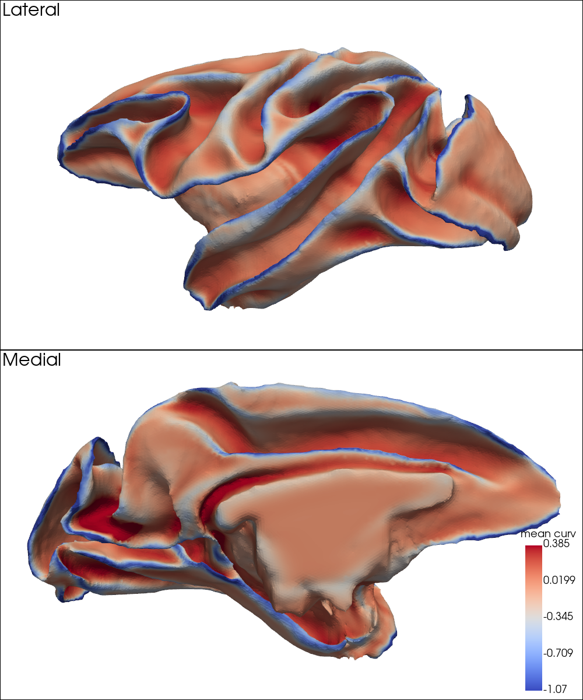
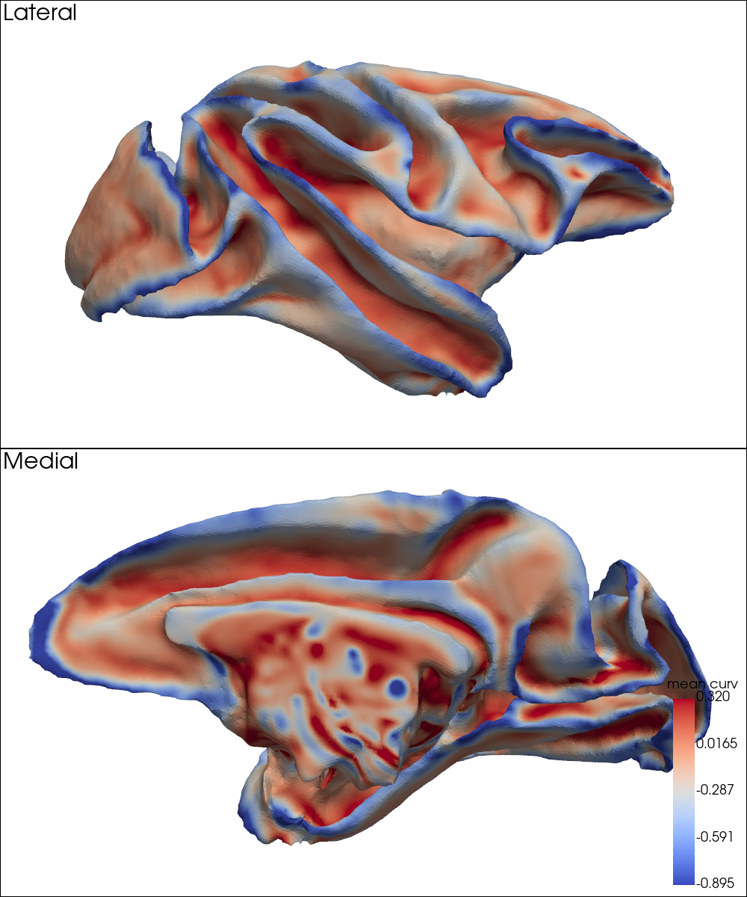
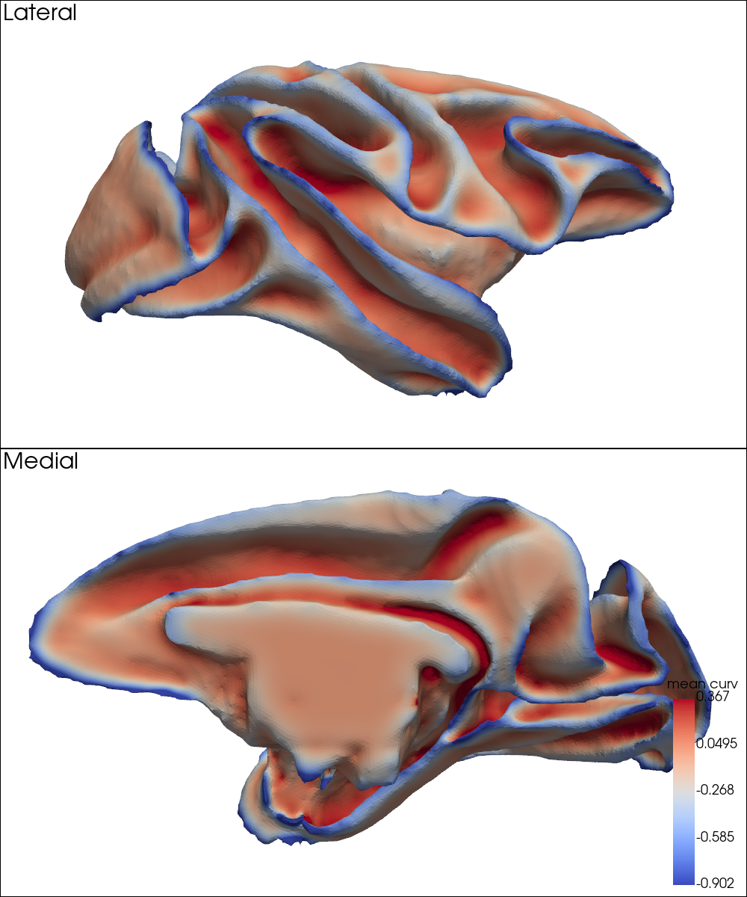

# MSM-based Surface Alignment with Mean Curvature

This document outlines the workflow and presents visual results of surface alignment using mean curvature, based on FSL's `msm` (Multimodal Surface Matching). This curvature-driven approach to surface alignment represents a common practice in current neuroimaging studies.

---

## Inputs and Methods

Several key inputs were generated in the preprocessing pipeline, as described in [`preprocessing.md`](preprocessing.md), including the spherical surfaces and corresponding mean curvature maps for each template, which are required by MSM, as well as harmonized medial wall (MW) masks used as `--inweight` and `--refweight` inputs to exclude inconsistent MW regions during alignment.

We observed that directly aligning templates using mean curvature features occasionally failed, particularly when curvature patterns were highly mismatched across initial spheres. This was especially problematic for the **YRK** template, which exhibited a distinct orientation of surface features compared to others. To address this, we created an anatomical prior for initialization based on the macaque Markov parcellation. Specifically, we selected a subset of well-defined cortical areas — including V1, V2, area 1, area 2, 8m, and 8l — along with the medial wall. These regions were assigned distinct numerical labels in a volume map constructed in YRK space using `wb_command -metric-to-volume-mapping`.

This labeled volume was then projected onto the surfaces of other templates using `wb_command -volume-to-surface-mapping`, ensuring anatomical correspondence across surface meshes. The resulting region-specific label files were used to perform an initial MSM alignment. The output deformation spheres from this step were passed to a second MSM alignment based on mean curvature using the `--trans` option, thereby serving as initialization for refinement.

---

## Outputs and Visual Results

MSM alignment results for each inter-template pair — specifically the deformation spheres used for inter-template transformations — are stored under [`standard_alignment/`](./deformation_spheres/standard_alignment/). For usage instructions, refer to the [`demo/`](./demo/) directory.

To assess the alignment quality, we visualized how well mean curvature patterns were matched between templates by projecting curvature maps from the moving to the target (fix) space and displaying them on both spherical and white matter surfaces.

---

## Mean Curvature Maps on Spherical Surfaces after MSM Alignment

This section presents the mean curvature patterns projected onto the spherical surfaces after MSM alignment.

- Diagonal entries show the native curvature maps on each template's native sphere.
- Off-diagonal entries show the curvature maps of the moving template projected onto the target sphere.

### Left Hemisphere

| Target → \ Moving ↓ | NMTv2.0-sym | NMTv2.0-asym | &nbsp;&nbsp;&nbsp;&nbsp;&nbsp;&nbsp;D99&nbsp;&nbsp;&nbsp;&nbsp;&nbsp;&nbsp; | MEBRAINS | &nbsp;&nbsp;&nbsp;&nbsp;&nbsp;&nbsp;YRK&nbsp;&nbsp;&nbsp;&nbsp;&nbsp;&nbsp; |
|---------------------|-------------|--------------|-----|----------|-----|
| **NMTv2.0-sym** |  |  |  |  |  |
| **NMTv2.0-asym** |  |  |  |  |  |
| **D99** |  |  |  |  |  |
| **MEBRAINS** |  |  |  |  |  |
| **YRK** |  |  |  |  |  |

### Right Hemisphere

| Target → \ Moving ↓ | NMTv2.0-sym | NMTv2.0-asym | &nbsp;&nbsp;&nbsp;&nbsp;&nbsp;&nbsp;&nbsp;D99&nbsp;&nbsp;&nbsp;&nbsp;&nbsp;&nbsp;&nbsp; | MEBRAINS | &nbsp;&nbsp;&nbsp;&nbsp;&nbsp;&nbsp;&nbsp;YRK&nbsp;&nbsp;&nbsp;&nbsp;&nbsp;&nbsp;&nbsp; |
|---------------------|-------------|--------------|-----|----------|-----|
| **NMTv2.0-sym** |  |  |  |  |  |
| **NMTv2.0-asym** |  |  |  |  |  |
| **D99** |  |  |  |  |  |
| **MEBRAINS** |  |  |  |  |  |
| **YRK** |  |  |  |  |  |

---

## Mean Curvature Maps on White Matter Surfaces after MSM Alignment

This section presents the mean curvature patterns projected onto the white matter surfaces after MSM alignment.

- Diagonal entries show the native curvature maps on each template's native white matter surface.
- Off-diagonal entries show the curvature maps of the moving template projected onto the target white matter surface.

### Left Hemisphere

| Target → \ Moving ↓ | NMTv2.0-sym | NMTv2.0-asym | &nbsp;&nbsp;&nbsp;&nbsp;&nbsp;&nbsp;&nbsp;D99&nbsp;&nbsp;&nbsp;&nbsp;&nbsp;&nbsp;&nbsp; | MEBRAINS | &nbsp;&nbsp;&nbsp;&nbsp;&nbsp;&nbsp;&nbsp;YRK&nbsp;&nbsp;&nbsp;&nbsp;&nbsp;&nbsp;&nbsp; |
|---------------------|-------------|--------------|-----|----------|-----|
| **NMTv2.0-sym** |  |  |  |  |  |
| **NMTv2.0-asym** |  |  |  |  |  |
| **D99** |  |  |  |  |  |
| **MEBRAINS** |  |  |  |  |  |
| **YRK** |  |  |  |  |  |

### Right Hemisphere

| Target → \ Moving ↓ | NMTv2.0-sym | NMTv2.0-asym | &nbsp;&nbsp;&nbsp;&nbsp;&nbsp;&nbsp;&nbsp;D99&nbsp;&nbsp;&nbsp;&nbsp;&nbsp;&nbsp;&nbsp; | MEBRAINS | &nbsp;&nbsp;&nbsp;&nbsp;&nbsp;&nbsp;&nbsp;YRK&nbsp;&nbsp;&nbsp;&nbsp;&nbsp;&nbsp;&nbsp; |
|---------------------|-------------|--------------|-----|----------|-----|
| **NMTv2.0-sym** |  |  |  |  |  |
| **NMTv2.0-asym** |  |  |  |  |  |
| **D99** |  |  |  |  |  |
| **MEBRAINS** |  |  |  |  |  |
| **YRK** |  |  |  |  |  |

---
