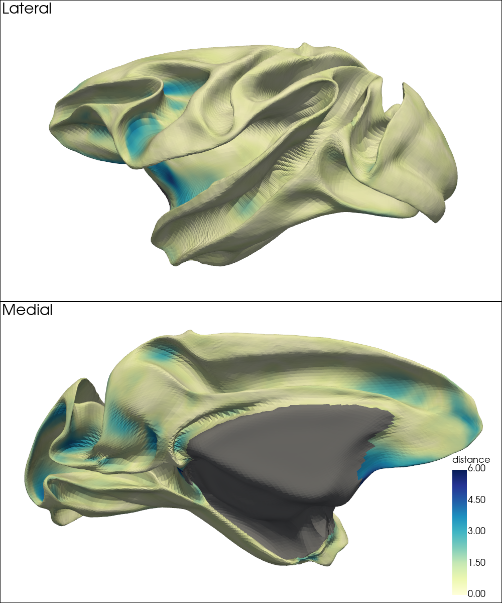
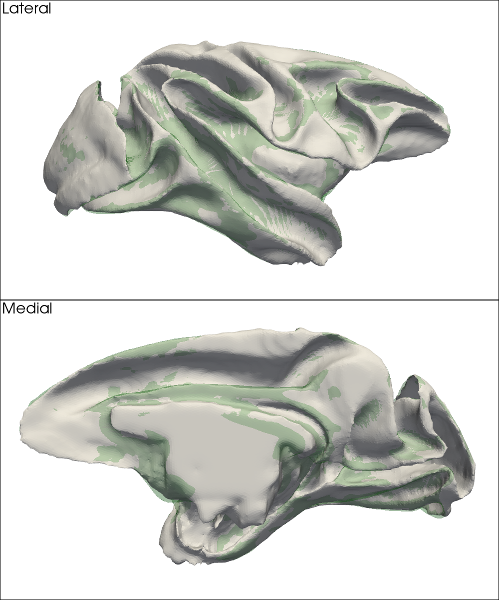
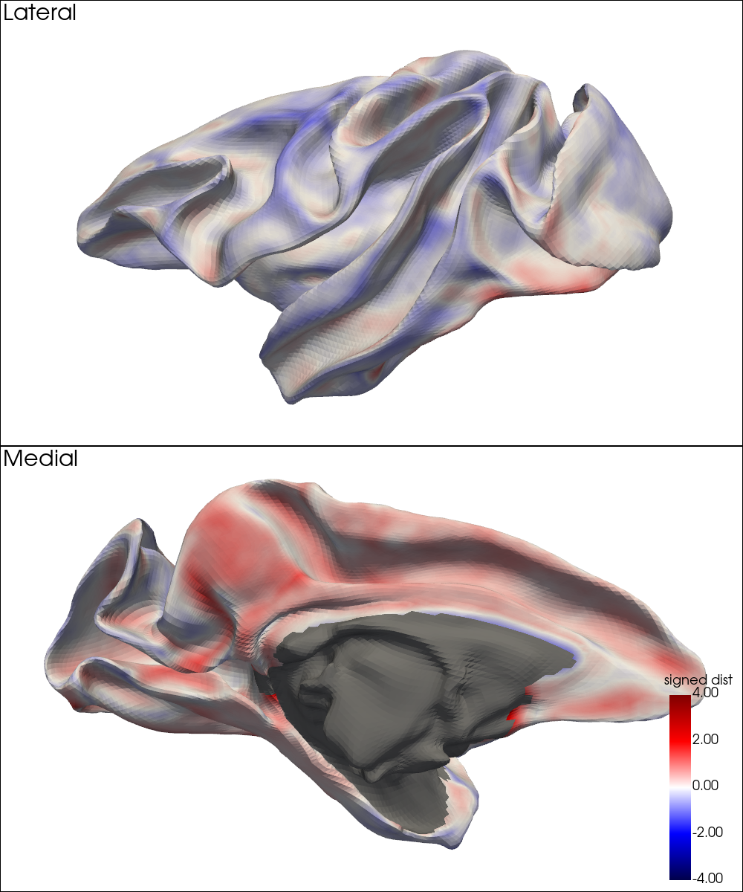
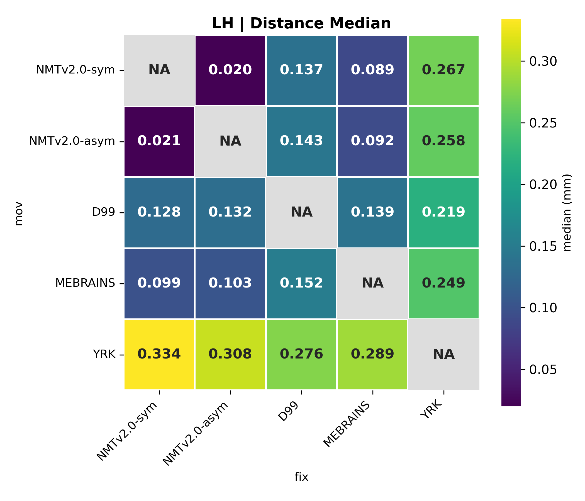

# MSM-based Surface Alignment with RheMAP-Projected Random Features

This document presents an alternative approach to inter-template surface alignment using **randomly generated feature maps** as the driving metric for MSM (Multimodal Surface Matching). Unlike conventional methods based on mean curvature or sulcal depth, this approach **projects structured random patterns** from volume space onto the native and RheMAP-aligned surfaces and uses them as robust, volumetrically-informed features to guide surface alignment.

This method is explicitly designed to approximate the inter-template volume registrations provided by the **RheMAP** project, thereby bridging the gap between volume- and surface-based alignment.

---

## Inputs and Methods

While the spherical surfaces, template-specific reference volumes (for each hemisphere and at multiple resolutions), and the RheMAP-aligned surfaces were already prepared in the [preprocessing pipeline](preprocessing.md), the generation of structured random features proceeds in two steps:

First, for each template, hemisphere, and resolution, we generated structured 3D random patterns using a custom Python script. These patterns fall into two modes:
- **dots**: spatially localized, Gaussian-smoothed noise
- **stripes**: directionally biased, low-pass filtered noise in the frequency domain

For both modes, multiple random samples were generated under low, medium, and high frequency settings.

Next, the volumetric random patterns were mapped to both the native and RheMAP-aligned white matter surfaces using `wb_command -volume-to-surface-mapping`. The resulting surface metric files were then grouped and merged with `wb_command -metric-merge` into three types of composite feature files:
1. Files containing patterns from a **single mode and frequency**
2. Files combining **multiple frequencies** of the **same mode**
3. Files mixing **different modes and frequencies**

During MSM alignment, the previously computed curvature-based alignment results were passed to the `--trans` option to initialize the optimization. Each merged file was used independently as the driving feature in a separate MSM alignment run. Alignment quality was assessed based on distance maps (see below for details), and the best-performing result was selected. This process was repeated by reusing the best result as the new initialization (`--trans`), but only minimal improvements were observed, indicating convergence.

### Evaluation of MSM Alignment Results

To quantify how well the MSM-aligned surfaces approximate the volume-based registrations from RheMAP, we computed vertex-wise 3D distances between:

1. The surface resampled via MSM alignment (`wb_command -surface-resample`), where topology matches the target (fix) template but geometry aligns with the native moving surface.
2. The target template surface warped into the moving space using RheMAP-provided volume warpfields.

We used `wb_command -surface-to-surface-3d-distance` to compute Euclidean distances between corresponding vertices. After excluding the medial wall (MW) region, we computed the **median**, **mean**, and **maximum** values of each distance map. Their **product** was used as a composite evaluation score, where lower scores indicate closer approximation to the RheMAP volume-based alignment.

---

## Outputs and Visual Results

MSM alignment results for each inter-template pair — specifically the deformation spheres used for inter-template transformations — are stored under [`approx_volume_alignment/`](./deformation_spheres/approx_volume_alignment/). For usage instructions, refer to the [`demo/`](./demo/) directory.

To visualize alignment quality, we rendered the vertex-wise distance maps on white matter surfaces, excluding MW regions (values set to `NaN`). All maps are displayed using a **fixed color scale (0–6 mm)** to allow direct comparison across templates and hemispheres.

In addition, we computed summary statistics (median, mean, maximum) across non-MW regions and presented them as heatmaps for each hemisphere. Results show that:
- **Median** distances mostly fall within **0.3–0.5 mm**
- **Mean** distances mostly fall within **0.3–0.6 mm**
- **Maximum** distances are generally several millimeters

Since the RheMAP-aligned surfaces are not guaranteed to be perfectly spatially aligned with the native moving surfaces, a substantial portion of the discrepancies observed in the distance maps is expected. Further analysis of the RheMAP-aligned surfaces confirms this observation (see Appendix). These findings indicate that the current MSM-based surface alignment provides a near-optimal approximation of the ANTs-derived volume registrations.

---

## Distance Maps Between MSM- and RheMAP-Aligned Surfaces

To compare the two alignment methods, we visualized vertex-wise 3D distances between MSM- and RheMAP-aligned white matter surfaces for each inter-template pair. Each map is shown with a fixed color scale (0–6 mm).

- Diagonal entries are omitted, as self-to-self alignment is not meaningful.
- Off-diagonal entries display distance maps on the target white matter surfaces.

### Left Hemisphere

| Target → \ Moving ↓ | NMTv2.0-sym | NMTv2.0-asym | D99 | MEBRAINS | YRK |
|---------------------|-------------|--------------|-----|----------|-----|
| **NMTv2.0-sym** |  |  |  |  |  |
| **NMTv2.0-asym** |  |  |  |  |  |
| **D99** |  |  |  |  |  |
| **MEBRAINS** |  |  |  |  |  |
| **YRK** |  |  |  |  |  |

### Right Hemisphere

| Target → \ Moving ↓ | NMTv2.0-sym | NMTv2.0-asym | D99 | MEBRAINS | YRK |
|---------------------|-------------|--------------|-----|----------|-----|
| **NMTv2.0-sym** |  |  |  |  |  |
| **NMTv2.0-asym** |  |  |  |  |  |
| **D99** |  |  |  |  |  |
| **MEBRAINS** |  |  |  |  |  |
| **YRK** |  |  |  |  |  |

---

## Summary of Distance Map Statistics

This section presents the **median**, **mean**, and **maximum** values of the distance maps (non-MW regions only), visualized as heatmaps across all inter-template pairs, separately for the left and right hemispheres.

| Statistic       | Left Hemisphere | Right Hemisphere |
|:---------------:|:---------------:|:----------------:|
| **Median** |        |        |
| **Mean**   |          |          |
| **Max**    |           |           |

---

## Appendix: Visualization and Analysis of RheMAP-Aligned Surfaces

To better interpret the residual discrepancies observed in the main surface alignment evaluation, we further analyzed the **RheMAP-aligned surfaces** — surfaces that were warped via ANTs-derived volume registrations while preserving vertex count and mesh topology. This appendix provides both qualitative and quantitative assessments of these warped surfaces.

---

### Surface Overlay Visualization Across Templates

We first assessed geometric consistency through visual overlay:

- The **native moving** white matter surface is shown as an **opaque white mesh**.
- The **warped** white matter surface from another template appears as a **semi-transparent green mesh**.

These overlays help reveal how well the warped surface conforms to the native surface geometry, with close alignment expected in cortical areas.

#### Left Hemisphere

| Warped (overlay) → / Native (opaque) ↓ | NMTv2.0-sym | NMTv2.0-asym | D99 | MEBRAINS | YRK |
|----------------------------------------|-------------|--------------|-----|----------|-----|
| **NMTv2.0-sym**     |  |  |  |  |  |
| **NMTv2.0-asym**    |  |  |  |  |  |
| **D99**             |  |  |  |  |  |
| **MEBRAINS**        |  |  |  |  |  |
| **YRK**             |  |  |  |  |  |

#### Right Hemisphere

| Warped (overlay) → / Native (opaque) ↓ | NMTv2.0-sym | NMTv2.0-asym | D99 | MEBRAINS | YRK |
|----------------------------------------|-------------|--------------|-----|----------|-----|
| **NMTv2.0-sym**     |  |  |  |  |  |
| **NMTv2.0-asym**    |  |  |  |  |  |
| **D99**             |  |  |  |  |  |
| **MEBRAINS**        |  |  |  |  |  |
| **YRK**             |  |  |  |  |  |

---

### Signed Distance Maps Between RheMAP-Aligned and Native Surfaces

We further computed **vertex-wise signed distances** to quantify the spatial deviation between the warped (RheMAP-aligned) white matter surface and the corresponding native white matter surface using `wb_command -signed-distance-to-surface`:

- Distances were measured from the native (reference) surface at every vertex on the warped (comparison) surface.
- All maps are displayed using a fixed color scale from **–4 mm (blue)** to **+4 mm (red)**, where negative values indicate vertices lying inside the native surface, and positive values indicate vertices outside.
- Vertices within the MW region were assigned `NaN` and excluded from all quantitative analyses.

#### Left Hemisphere

| Warped (fix) → / Native (moving) ↓ | NMTv2.0-sym | NMTv2.0-asym | D99 | MEBRAINS | YRK |
|------------------------------------|-------------|--------------|-----|----------|-----|
| **NMTv2.0-sym**  |       |  |  |  |  |
| **NMTv2.0-asym** |  |       |  |  |  |
| **D99**          |  |  |       |  |  |
| **MEBRAINS**     |  |  |  |       |  |
| **YRK**          |  |  |  |  |       |

#### Right Hemisphere

| Warped (fix) → / Native (moving) ↓ | NMTv2.0-sym | NMTv2.0-asym | D99 | MEBRAINS | YRK |
|------------------------------------|-------------|--------------|-----|----------|-----|
| **NMTv2.0-sym**  |       |  |  |  |  |
| **NMTv2.0-asym** |  |       |  |  |  |
| **D99**          |  |  |       |  |  |
| **MEBRAINS**     |  |  |  |       |  |
| **YRK**          |  |  |  |  |       |

---

### Summary of Absolute Signed Distance Statistics

This section presents the **median**, **mean**, and **maximum** values of the absolute signed distances (non-MW regions only), visualized as heatmaps across all inter-template pairs, separately for the left and right hemispheres.

| Statistic       | Left Hemisphere | Right Hemisphere |
|:---------------:|:---------------:|:----------------:|
| **Median** |        |        |
| **Mean**   |          |          |
| **Max**    |           |           |

---
