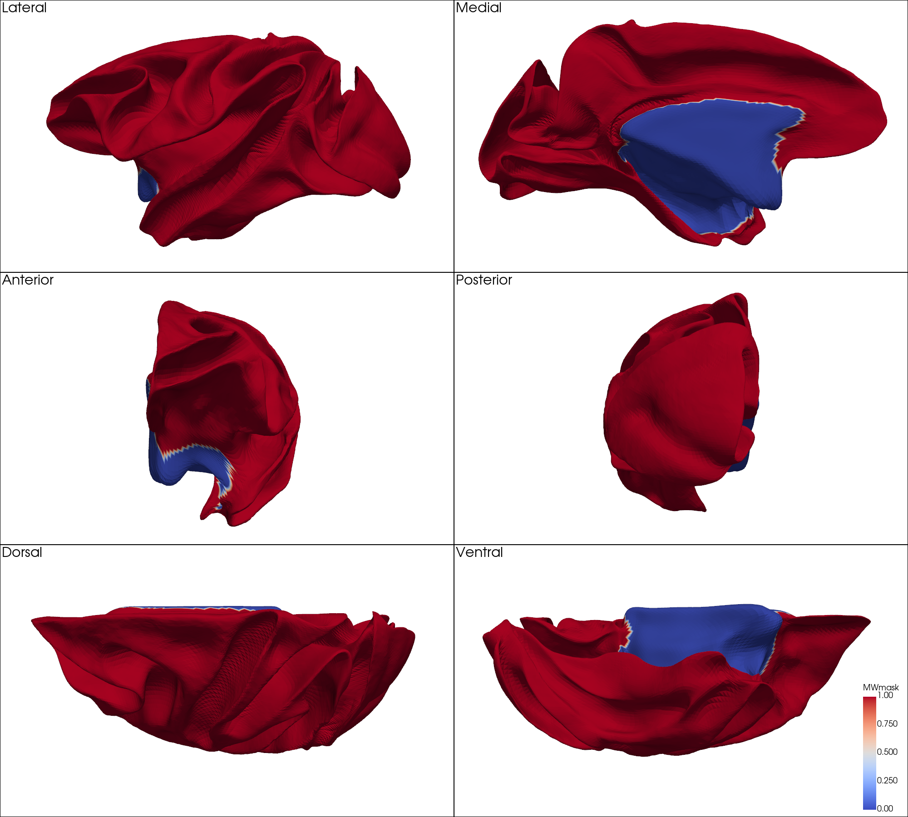

# RheMAP-Surf Preprocessing Pipeline

This document outlines the full preprocessing pipeline used to prepare cortical surfaces and surface-based features from five widely-used macaque brain templates for the **RheMAP-Surf** project.

The input data to the pipeline includes:
- Surface and volume files from five reference templates (see [`templates/`](./templates/) for details)
- Inter-template volume warp fields from the [RheMAP project](https://gin.g-node.org/ChrisKlink/RheMAP/src/master/warps/final)

---

## Step 1: Collection, Renaming, and Template-Specific Corrections

We first collected the original T1-weighted structural volumes and cortical surface files (left and right hemispheres) for the five reference templates: `NMTv2.0-sym`, `NMTv2.0-asym`, `D99`, `MEBRAINS` (MEBRAINS v2.0), and `YRK` (Yerkes19). All files were organized under the [`templates/`](./templates/) directory.

To ensure naming consistency across templates, volumes and surfaces were renamed using the following standardized conventions:
- Volumes: `<template>.nii.gz`
- Surfaces: `<hemi>.<template>.<type>.surf.gii`

Where:
- `<hemi>` is `lh` or `rh`
- `<template>` refers to the template name
- `<type>` is one of: `wm`, `mid`, `pial`, or `sphere`

### Template-Specific Corrections

- **D99**
  - The original left hemisphere surfaces had inverted surface normals. This was corrected using `wb_command -surface-flip-normals`.
  - The native spherical surface was not centered at the origin, and its radius was not standardized. We applied `wb_command -surface-modify-sphere` to recenter the sphere and normalize its radius to 100 mm for consistency with other templates.

- **MEBRAINS**
  - The surfaces were spatially misaligned with the T1-weighted volume. We extracted the c_ras translation using FreeSurfer's `mri_info --cras`, generated an affine transformation matrix, and applied it using `wb_command -surface-apply-affine`.
  - Since midthickness (`mid`) surfaces were not included, they were generated by averaging the corresponding white matter (`wm`) and pial (`pial`) surfaces.

- **All Templates**
  - All final surfaces had their metadata cleaned and structure information added via a custom Python function. Each surface's structure (e.g., cortex left or right) was explicitly set using `wb_command -set-structure`.

---

## Step 2: Cross-Template Surface Warping and Reference Volume Generation

In this step, we utilized the ANTs-derived volume-to-volume warp fields from the RheMAP project to perform the following operations:

1. **Warpfield conversion**  
RheMAP-provided ITK-format warpfields were converted into Connectome Workbench-compatible "world" warpfields using `wb_command -convert-warpfield -from-itk <input> -to-world <output>`.

2. **Surface warping**  
For each source surface and target template space, we applied the corresponding warpfield using `wb_command -surface-apply-warpfield`. This yielded warped variants of each source surface aligned to the target space. The warped surfaces preserve the original vertex topology but are spatially aligned — at least approximately — with the native surface mesh in the target template space.

3. **Bounding box calculation**  
For each hemisphere and template, we computed the spatial bounding box across all warped surfaces and the native surfaces. This defines the valid coordinate extent required to contain all surfaces.

4. **Reference volume generation**  
Using the bounding boxes and a fixed 2-voxel margin, we generated multi-resolution reference volumes via a custom Python script. The generated voxel resolutions include: 0.5, 0.4, 0.3, 0.25, and 0.2 mm.

The warped surfaces and reference volumes produced here are not only used in subsequent steps of the preprocessing pipeline, but also play a critical role in downstream analyses. In particular, they serve as the spatial framework for sampling randomized features in surface alignment tasks that approximate ANTs-derived volume warp fields, and for evaluating the geometric correspondence between ANTs-warped surfaces and those aligned via MSM (Multimodal Surface Matching).

---

## Step 3: Curvature Computation and Sphere Generation

### Curvature Computation

Mean curvature was computed for the white matter surface of each template using FreeSurfer's `mris_curvature`. To ensure consistent visual sharpness of the curvature features across templates with differing surface resolutions and mesh smoothness, we applied template-specific levels of smoothing (via `-a <avgs>`, which performs `<avgs>` iterative averages of the curvature measure before saving). The resulting mean curvature maps serve as input features for subsequent MSM-based surface alignment.

| Template     | Vertex Count        | Face Count          | Smoothing Iterations |
|--------------|---------------------|---------------------|----------------------|
| NMTv2.0-sym  | 40962               | 81920               | 5                    |
| NMTv2.0-asym | 40962               | 81920               | 5                    |
| D99          | 167625              | 335246              | 20                   |
| MEBRAINS     | 100988/100974 (L/R) | 201972/201944 (L/R) | 15                   |
| YRK          | 32492               | 64980               | 1                    |

#### Mean Curvature Maps

The figures below illustrate the mean curvature patterns computed on the native white matter surfaces of each hemisphere and template. For each, we provide:
- A **surface without metric** overlay to visualize cortical geometry.
- A **surface with mean curvature overlaid** to assess the consistency of mean curvature patterns across templates.

##### Left Hemisphere

| Template       | <pre style="text-align:center;">    Surface Only    </pre> | <pre style="text-align:center;"> With Mean Curvature</pre> |
|----------------|--------------|---------------------|
| NMTv2.0-sym    |  |  |
| NMTv2.0-asym   |  |  |
| D99            |  |  |
| MEBRAINS       |  |  |
| YRK            |  |  |

##### Right Hemisphere

| Template       | <pre style="text-align:center;">    Surface Only    </pre> | <pre style="text-align:center;"> With Mean Curvature</pre> |
|----------------|--------------|---------------------|
| NMTv2.0-sym    |  |  |
| NMTv2.0-asym   |  |  |
| D99            |  |  |
| MEBRAINS       |  |  |
| YRK            |  |  |

---

### Sphere Generation

For **NMTv2.0-sym**, **NMTv2.0-asym**, and **MEBRAINS** (MEBRAINS v2.0), spherical surfaces were not provided. Since conformal spheres are required for surface-based registration methods such as MSM (Multimodal Surface Matching), we generated spherical surfaces using the standard FreeSurfer pipeline:

1. Inflate the white matter surface using `mris_inflate`
2. Generate a conformal sphere with `mris_sphere`

For **D99**, although the template includes published spherical surfaces, we instead generated new spheres based on its midthickness surfaces that had undergone medial wall smoothing and were warped into NMTv2.0-sym space. Using the midthickness surface led to fewer reports of negative triangles during `mris_sphere`, while warping into the NMTv2.0-sym space helped ensure better alignment in orientation with the other templates. Additionally, medial wall smoothing reduced over-expansion in the medial wall region — an issue observed when using the native white surface of the D99 template without smoothing. Moreover, our tests showed that:

- The original D99 spheres required large deformations to align with spheres from other templates.
- Such deformations exceeded the default regularization limits in MSM.
- Using spheres generated from smoothed and aligned midthickness surfaces provided more stable and accurate registration.

Thus, while the deformation spheres released in this project have been mapped to align with the published spherical surfaces of D99, the FreeSurfer-generated spheres are used solely as **temporary inputs** for MSM-based alignment workflows.

---

## Step 4: Harmonized Medial Wall Mask Extraction

Due to inconsistent definitions of the medial wall (MW) across macaque brain templates, we constructed cross-template harmonized MW masks based on the published MW annotations in **D99** and **YRK** spaces. The processing strategy is as follows:

1. **Initial cut surfaces**:  
   MW definitions published with the D99 and YRK templates were used to extract cortical-only vertices. These were applied to the respective native surfaces to generate MW-excluded "cut" surfaces, serving as references.

2. **Coarse extraction via distance-based filtering**:  
   Warped surfaces from other templates (transformed into D99 or YRK space) were compared against the MW-excluded base surfaces using `wb_command -signed-distance-to-surface`. Vertices with distances below a defined threshold were considered provisional cortical (non-MW) regions.

3. **Conversion to volume space**:  
   These provisional cortical regions were projected into volume space via `wb_command -metric-to-volume-mapping`, allowing alignment with D99 or YRK cortical volumes via ANTs registration and enabling correction for residual inter-template mismatch.

4. **Volume registration and refined surface warping**:  
   The projected cortical volumes were aligned to the target D99 or YRK space using ANTs. The resulting warp fields were then used to further warp the original warped surfaces for fine-grained spatial correspondence.

5. **Refined re-extraction**:  
   The newly warped surfaces were re-compared to the MW-excluded base using a stricter signed distance threshold, yielding refined definitions of cortical (non-MW) vertices.

6. **Mask cleanup**:  
   A custom Python script was used for final refinement of the MW masks:
   - Isolating the main connected MW component
   - Filling holes completely surrounded by MW vertices
   - Trimming sharp or irregular spikes at the MW–cortex boundary

7. **Union of masks**:  
   For each hemisphere and template, the harmonized MW mask was defined as the union of the independently derived masks in D99 and YRK space.

### Final Harmonized Medial Wall Masks

To evaluate the consistency of the harmonized MW masks across the five templates, we projected the final binary masks onto the white matter surfaces of each template (shown in YRK space). Each hemisphere is shown separately, using a fixed color scale ranging from 0 (MW region) to 1 (cortical region).

| Template       | Left Hemisphere | Right Hemisphere |
|----------------|-----------------|------------------|
| NMTv2.0-sym    |   |   |
| NMTv2.0-asym   |  |  |
| D99            |           |           |
| MEBRAINS       |      |      |
| YRK            |           |           |

These harmonized MW masks are used in downstream workflows as weighting masks for MSM-based surface alignment, where MW regions are assigned a weight of 0 and cortical regions a weight of 1. This ensures that variability in MW definitions does not bias the alignment process. They are also used to exclude MW regions from evaluation metrics when assessing surface alignment quality across templates. For users interested in applying these MW masks in their own workflows, the files are available at [`surfaces/medialWallConsensus/`](./surfaces/medialWallConsensus/).

---
